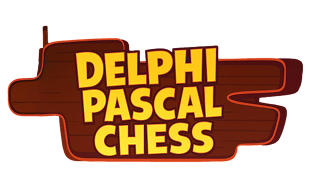
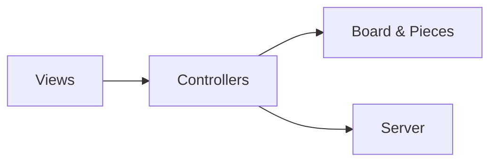
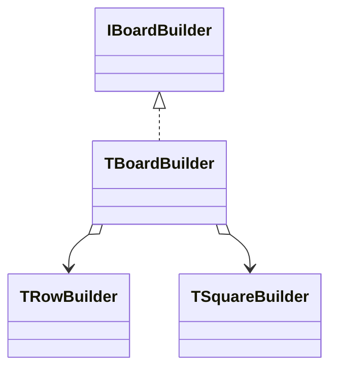
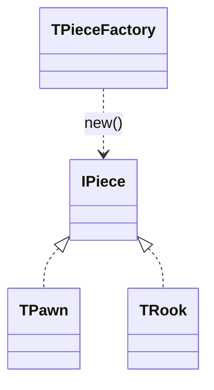
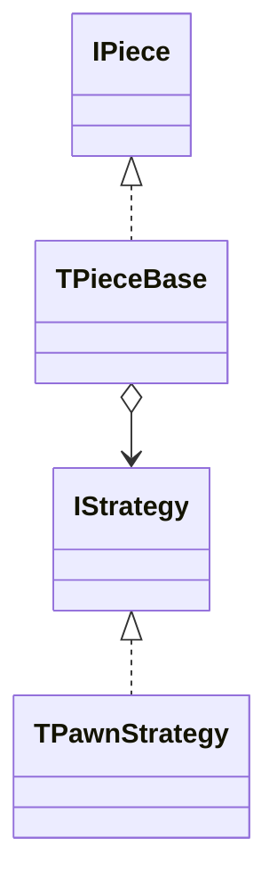
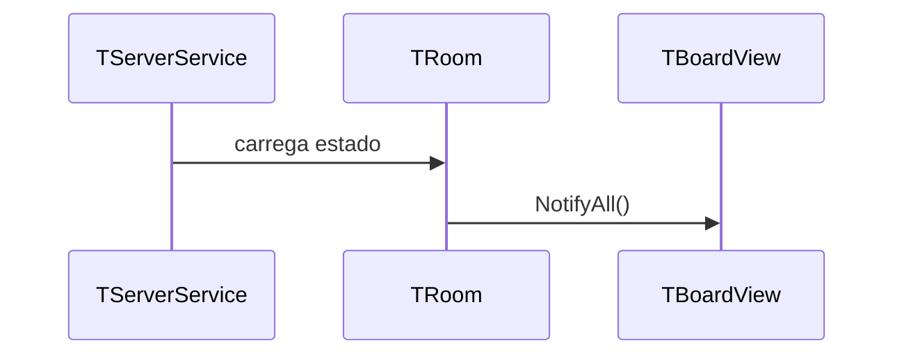
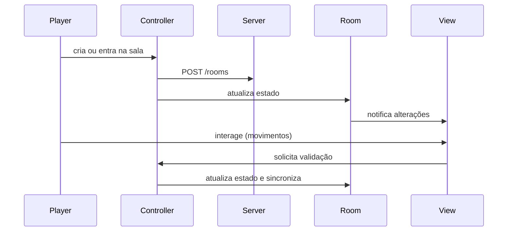

<p align="center">
  
</p>

<h1 align="center">Delphi Pascal Chess</h1>

## Visão Geral

Pascal Chess é um estudo de caso de desenvolvimento de um jogo de xadrez em **Object Pascal**. O projeto une uma aplicação desktop (Delphi/Lazarus) a um pequeno servidor HTTP escrito em Node.js, permitindo partidas online e armazenamento do estado do jogo.

Criado para praticar e ensinar o uso de **Design Patterns**, o projeto demonstra diferentes padrões de projeto aplicados no contexto de um jogo de xadrez.
Por ser um estudo e evitar dependências de pacotes de terceiros, a comunicação com o servidor é feita apenas via HTTP simples, sem uso de WebSockets.

## Estrutura do Projeto

```text
pascal-chess/
├── src/
│   ├── Board/           # Modelo: estado do tabuleiro e regras
│   ├── Controllers/     # Lógica de controle e comunicação
│   ├── Pieces/          # Implementação das peças e estratégias
│   ├── Views/           # Telas (VCL) da aplicação
│   ├── Server/          # Serviço HTTP e fachada Indy
│   └── Utils/           # Utilidades diversas
├── package.json         # Script para iniciar o servidor Node
└── README.md
```

## Padrões de Projeto Utilizados

### Arquitetura MVC
O código está organizado em camadas de **Model**, **View** e **Controller**. As classes de tabuleiro e peças ficam em `src/Board` e `src/Pieces` (Model), as telas VCL em `src/Views` (View) e a coordenação entre elas em `src/Controllers` (Controller).



### Builder – Construção do Tabuleiro
O tabuleiro gráfico é montado passo a passo através do *builder* `TBoardBuilder` e auxiliares (`TRowBuilder`, `TSquareBuilder`).



### Factory – Criação de Peças
A criação das peças é centralizada em `TPieceFactory`, que decide qual classe instanciar de acordo com o tipo solicitado.



### Strategy – Movimentos das Peças
Cada peça utiliza uma estratégia diferente para calcular movimentos válidos. A classe `TPieceBase` delega o cálculo para objetos que implementam `IStrategy` (ex.: `TPawnStrategy`).



### Observer – Atualização de Estado
A sala de jogo (`TRoom`) notifica observadores sempre que seu estado é alterado, permitindo que as views atualizem a interface em tempo real.



### Facade – Cliente HTTP Indy
A unidade `PC.Indy.Facade` encapsula o uso da biblioteca Indy, expondo uma interface simples `IHttpClient` para o restante da aplicação.

### Singleton – Controlador de Sala
`TRoomController` mantém uma única instância da sala e do jogador atual por meio de variáveis de classe, funcionando como um *singleton* para acesso global.

## Como Usar

1. **Servidor HTTP**
   ```bash
   npm start
   ```
   O comando acima executa `src/Server/server.js`, responsável por persistir e recuperar o estado das salas.

2. **Aplicação Pascal**
   - Abra o projeto `src/PascalChess.dpr` em Delphi ou Lazarus.
   - Compile e execute. A aplicação irá consumir o servidor acima para listar salas, criar partidas e jogar.
   - Para rodar localmente, altere a constante `SERVER_ENDPOINT` no arquivo `src/Controllers/PC.Room.Controller.pas` para `http://localhost:3000`.

## Diagramas Extras

Diagrama simplificado do fluxo principal de uma partida:



## Licença
Distribuído sob a licença MIT. Consulte o arquivo `LICENSE` para mais detalhes.

As imagens e ícones utilizados pertencem a seus respectivos autores e possuem direitos autorais; não são de minha autoria.
